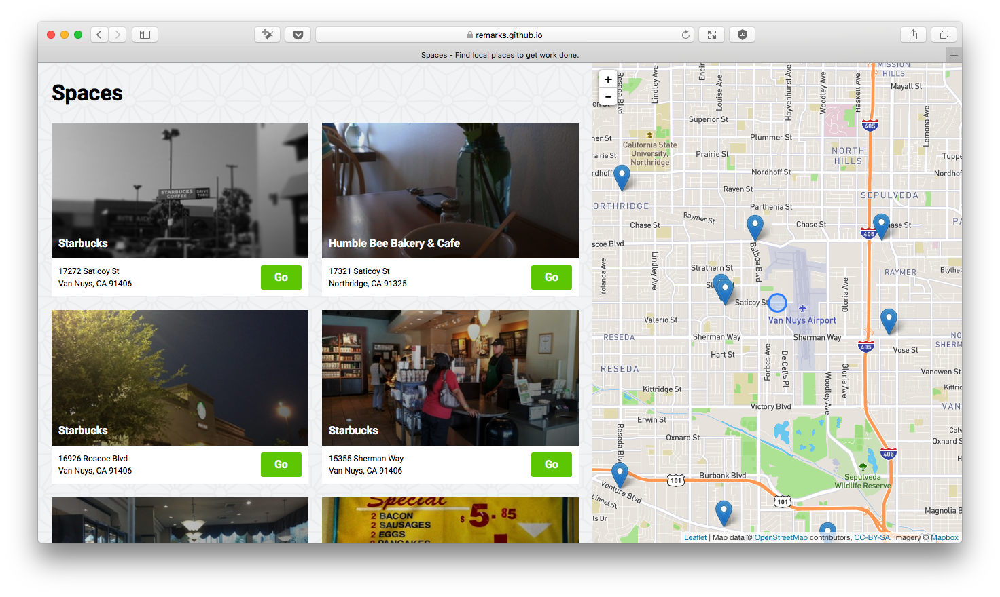

# Workspaces

I work remote for my day job, so I like working at coffee shops frequently. I made this app so I could find local coffee shops around me easily to work.

This capstone uses HTML/CSS/jQuery, as well as two APIs. Leaflet.js (with Mapbox) for the mapping functionality and FourSquare for the venue results.